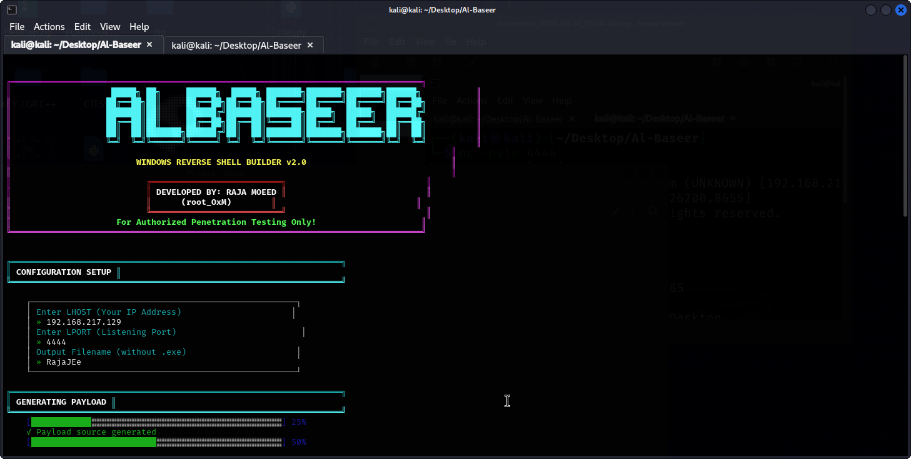

# 📡 AL-BASEER WINDOWS REVERSE SHELL BUILDER v2.0

<p align="center">
  
  
  
  
</p>

---

## ⚡ Overview

**Al-Baseer v2.0** is an interactive configuration utility designed for educational research and authorized penetration testing. The tool streamlines the cross-compilation process by utilizing `x86_64-w64-mingw32-g++` on Linux environments to output binaries configured for Windows environments. This allows security analysts to study network socket behaviors, process execution parameters, and defensive logging mechanisms.

> ⚠️ **Security Notes & Disclaimer:** 
> * This tool is for authorized penetration testing only!
> * Unauthorized use is illegal and unethical.
> * Always obtain proper authorization before testing.

---

## 🖥️ Interface & Workflow Previews

### 1. Configuration Setup & Compilation
The interactive interface prompts the user for connection parameters (LHOST, LPORT, and output filename) before executing the compilation pipeline.

<p align="center">
  
</p>

### 2. Payload Information & Usage Instructions
Upon successful compilation, the framework outputs detailed structural metadata, including file size and execution properties.

<p align="center">
  
</p>

### 3. Connection Verification
An example of verifying connection handling and interactive terminal behavior during an authorized evaluation session.

<p align="center">
  
</p>

---

## 🚀 Core Modules & Capabilities

| Module Category | Feature Sub-Systems | Technical Specifications |
| :--- | :--- | :--- |
| **01 ⚙️ Configuration** | Parameter Setup | • Dynamic entry for listening host (`LHOST`) and port (`LPORT`).<br>• Custom binary naming conventions. |
| **02 🛠️ Cross-Compilation** | MinGW-w64 Toolchain | • Automates invocation of `x86_64-w64-mingw32-g++`.<br>• Compiles source structures into executable formats. |
| **03 🔍 Post-Exploration** | Environment Analysis | • Validates Windows terminal responses (`cmd.exe` / `dir`).<br>• Assists in reviewing defensive visibility metrics. |

---

## ⚙️ Administrative Setup

To run the configuration interface within a standard Linux security auditing environment:

```bash
# Clone the repository
git clone [https://github.com/Moeed0xM/Al-Baseer.git](https://github.com/Moeed0xM/Al-Baseer.git)
cd Al-Baseer

# Ensure cross-compilation dependencies are present
# Example for Debian/Ubuntu environments:
# sudo apt-get install mingw-w64

# Execute the builder framework
./baseer
